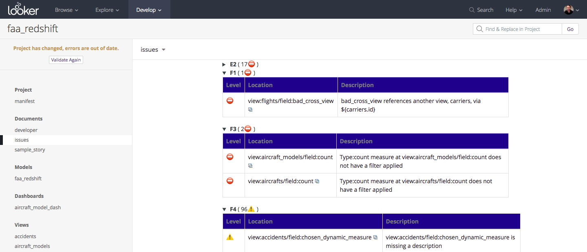

# Look At Me Sideways (LAMS)

LAMS is a style guide and linter for [Looker](https://looker.com/)'s LookML data modeling language. It is designed to help a team of developers to produce more maintainable LookML projects.

- The [style guide](https://looker-open-source.github.io/look-at-me-sideways/rules.html) alone can help your project, even without enforcement by the linter.
- The linter can be configured to enforce rules from the style guide for all commits to your master branch.
- The linter also allows you to conveniently specify custom rules to enforce.
- In addition to enforcing rules, the linter also produces markdown files to help developers navigate the project.

Interested? See a video of LAMS in action!

[](https://drive.google.com/file/d/1N5N26n52O2i95tz5vUZpoG1Ic3b3nNAQ/view)

### Deployment

##### Interactive Usage

To use LAMS with the least overhead for simple interactive local use and testing:

	npm install -g @looker/look-at-me-sideways
	cd <your-lookml-project>
	lams

(We will be publishing LAMS to NPM shortly after its release to simplify the above)

##### Docker

Although LAMS can be deployed manually using your CI tool of choice, we have provided a Docker image to simplify the deployment. Documentation can be found [here](https://github.com/looker-open-source/look-at-me-sideways/blob/master/docker/README.md).

##### Manifest.lkml (optional)

If your LookML project doesn't have a manifest.lkml file, you may want to consider adding one! By specifying a 'project_name' in your manifest, LAMS will be able to generate the correct links back to your project files in your instance.

### Linter Features

##### Ruleset Support

As of the current release, the Linter enforces rules K1-4, F1-4, E1-2, and T1-10.

It currently does not resolve `extends` references, so if you are complying with a rule via extension, use a rule exemption as noted below.

##### Rule Exemption

One of the best practices required by the style guide is that whenever a rule is not followed, the reason should be documented in a LookML comment. In fact, the linter accepts a specific format for these exemption reasons to allow them to be checked:

```lkml
view: rollup {
  derived_table: {
    sql_trigger_value: SELECT CURRENT_DATE() ;;
    # LAMS
    # rule_exemptions: {
    #  T1: "2018-11-12 - I can't use datagroups for this super special reason and Bob said it's ok"
    # }
    sql: SELECT ...
```

If you want to entirely opt-out of checking a particular rule, you can specify the exemptions in your project's manifest.lkml file. See [Customizing LAMS](https://looker-open-source.github.io/look-at-me-sideways/customizing-lams)

Note: For large projects with many exemptions, we suggest starting the reasons with the Y-M-D formatted date on which they were added, for easier review in your issue report.

##### Generated Markdown Files
One of the primary ways that LAMS gives developers feedback, in addition to passing/failing pull requests, is by adding its findings to markdown files in your project. Here is an example of a resulting markdown file as displayed in Looker:



##### Customizing LAMS

In addition to linting against its style guide, LAMS also lets you disable rules or specify your own rules. See [Customizing LAMS](https://looker-open-source.github.io/look-at-me-sideways/customizing-lams) .

### About

##### Privacy Policy
LAMS respects user privacy. See [PRIVACY.md](https://github.com/looker-open-source/look-at-me-sideways/blob/master/PRIVACY.md) for details.

##### License
LAMS is Copyright (c) 2018 Looker Data Sciences, Inc. and is licensed under the MIT License. See [LICENSE.txt](https://github.com/looker-open-source/look-at-me-sideways/blob/master/LICENSE.txt) for license details.

##### Support
LAMS is NOT officially supported by Looker. Please do not contact Looker support for issues with LAMS. Issues may be reported via https://github.com/looker-open-source/look-at-me-sideways/issues , but no SLA or warranty exists that they will be resolved.

##### Authors
LAMS has primarily been developed by [Joseph Axisa](https://github.com/josephaxisa) and [Fabio Beltramini](https://github.com/looker-open-source). See [all contributors](https://github.com/looker-open-source/look-at-me-sideways/graphs/contributors)

##### Contributing
Bug reports and pull requests are welcome on GitHub at https://github.com/looker-open-source/look-at-me-sideways.

##### Code of Conduct
This project is intended to be a safe, welcoming space for collaboration, and contributors are expected to adhere to the
[Contributer Covenant Code of Conduct](https://www.contributor-covenant.org/version/1/4/code-of-conduct). Concerns or
incidents may be reported confidentially to fabio@looker.com.


`>_>`
