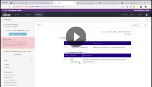
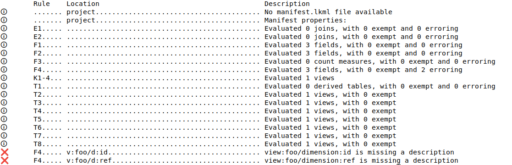
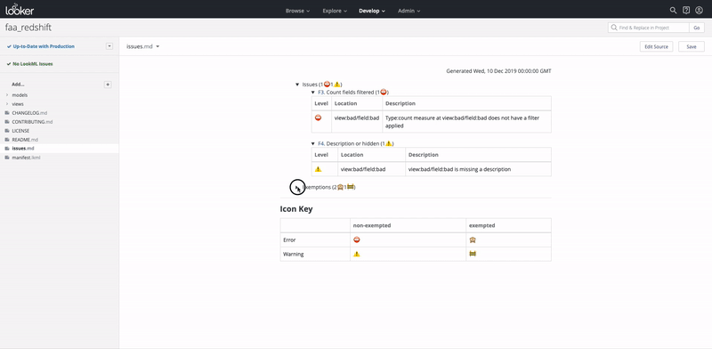

# Look At Me Sideways (LAMS)


LAMS is a style guide and linter for [Looker](https://looker.com/)'s LookML data modeling language. It is designed to help a team of developers to produce more maintainable LookML projects.

- The [style guide](https://looker-open-source.github.io/look-at-me-sideways/rules.html) alone can help your project, even without enforcement by the linter.
- The linter comes with a number of built-in rules from the style guide.
- The linter also allows you to conveniently specify custom rules to enforce.
- The linter can be deployed to enforce rules for all commits to your master branch.

Interested? See a video of LAMS in action!

[](https://drive.google.com/file/d/1SYZxcbMs-NbT1iaThbz_CNjDXKhn3Wrt/view)

## Contents

- [Functionality & Features](#functionality--features)
	- [Built-in Linter Rules](#built-in-linter-rules)
	- [Rule Exemptions](#rule-exemptions)
	- [Custom Rules](#custom-rules)
	- [Output](#output)
- [Deployment Examples](#deployment-examples)
- [Configuration](#configuration)
- [About](#about)

## Functionality & Features

### Built-in Linter Rules

The linter comes with built-in rules that can enforce rules K1-4, F1-4, E1-2, T1-2, and W1 from the [style guide](https://looker-open-source.github.io/look-at-me-sideways/rules.html).

As of LAMS v3, you must opt-in via your [manifest](#manifest-configurations) to use the built-in rules. Here is an example declaration opting in to all the currently available built-in rules:

```lkml
#LAMS
#rule: K1{} # Primary key naming
#rule: K3{} # Primary keys first
#rule: K4{} # Primary keys hidden
#rule: K7{} # Provide one `primary_key`
#rule: K8{} # `primary_key` uses PK dims
#rule: F1{} # No cross-view fields
#rule: F2{} # No view-labeled fields
#rule: F3{} # Count fields filtered
#rule: F4{} # Description or hidden
#rule: E1{} # Join with subst'n operator
#rule: E2{} # Join on PK for "one" joins
#rule: E6{} # FK joins are m:1
#rule: E7{} # Explore label 25-char max
#rule: T1{} # Triggers use datagroups 
#rule: T2{} # Primary keys in DT
#rule: W1{} # Block indentation
```

### Custom Rules

In addition to linting against its [style guide](https://looker-open-source.github.io/look-at-me-sideways/rules.html), LAMS also lets you specify your own rules. See [Customizing LAMS](https://looker-open-source.github.io/look-at-me-sideways/customizing-lams).

### Rule Exemptions

You can opt-out of rules granularly by locally specifying rule exemptions.

The rule exemption syntax encourages developers (optionally) to document the reason for each such exemption:

```lkml
view: rollup {
  sql_table_name: my_table ;;

  #LAMS exempt: K3 {why: "Bob said it's ok"}

  dimension: info {...}
  ...
```

(BETA) You can also opt-out of rules granularly from a centrally maintained `lams-exemptions.ndjson` file. Simply specify the rule name and location to exempt in a series of newline-terminated JSON objects:

```js
{"rule":"K3","location":"model:my_model/view:rollup"}
{"rule":"K3","location":"model:my_other_model/view:foo"}
```

### Output

Once LAMS has evaluated your project against the necessary rules, the resulting list of messages are communicated back to you through one of several output modes.

The default mode is a human-readable tabble logged to the command line / stdout, where each line represents a distinct message:



Another available output mode is formatting the messages into a markdown file in your project, so that they can be viewed in Looker's IDE. Here is an example of a resulting markdown file as displayed in Looker:



## Deployment Examples

Although LAMS can be deployed in many ways to fit your specific CI flow, we have put together a few examples and resources to get you up and running quicker. (If you'd like to contribute your configuration, [get in touch](https://github.com/looker-open-source/look-at-me-sideways/issues/new)!)

Regardless of which example you follow, we recommend pinning your LAMS version to a particular major version.

- **Local Interactive Usage** - To use LAMS with the least overhead for simple interactive local use and testing:

```bash
npm install -g @looker/look-at-me-sideways@3
cd <your-lookml-project>
lams
```

- **[Github Action](https://looker-open-source.github.io/look-at-me-sideways/github-action)** - This option is commonly used among LAMS users, and has an up-to-date and convenient deployment example.

The remaining examples were prepared for v1 of LAMS, though updating them for v2+ should be straightforward. Please review [v2 release notes](https://looker-open-source.github.io/look-at-me-sideways/release-notes/v2) for details. In particular, look for error messages on the console's standard output rather than a file output to be committed back to the repo. 

- **[GitLab CI](https://looker-open-source.github.io/look-at-me-sideways/gitlab-ci)** - A community-contributed configuration for GitLab, which offers similarly low overhead as our dockerized Jenkins configuration
- **[Dockerized Jenkins Server](https://github.com/looker-open-source/look-at-me-sideways/blob/master/docker/README.md)** - We have provided a Docker image with an end-to-end configuration including a Jenkins server, LAMS, and Github protected branches & status checks configuration. 
- **[CircleCI](https://github.com/renewdotcom/renew-looker-template/blob/master/.circleci)** - A community-contributed configuration for CircleCI (external link) 

## Configuration

### Command-line arguments

- **reporting** - Required. One of `yes`, `no`, `save-yes`, or `save-no`. See [PRIVACY.md](https://github.com/looker-open-source/look-at-me-sideways/blob/master/PRIVACY.md) for details.
- **report-user** - An email address to use in reporting. See [PRIVACY.md](https://github.com/looker-open-source/look-at-me-sideways/blob/master/PRIVACY.md) for details.
- **report-license-key** - A Looker license key to use in reporting. See [PRIVACY.md](https://github.com/looker-open-source/look-at-me-sideways/blob/master/PRIVACY.md) for details.
- **output** - A comma-separated string of output modes from among: `lines` (default), `markdown`, `markdown-developer`, `jenkins`, `legacy-cli`, or (BETA) `add-exemptions`
- **source** - A glob specifying which files to read. Defaults to `**/{*.model,*.explore,*.view,manifest}.lkml`.
- **cwd** - A path for LAMS to use as its current working directory. Useful if you are not invoking lams from your LookML repo directory.
- **project-name** - An optional name for the project, used to generate links back to the project in mardown output. Specifying this in manifest.lkml is preferred.
- **manifest-defaults** - A file path or JSON-encoded object of default manifest values which may be overriden by the project manifest. The target file may be a lkml file, JSON file, or a YAML file if the `js-yaml` optional peer dependency is installed.
- **manifest** - A file path or JSON-encoded object of manifest values that override values set by the project manifest. The target file may be a lkml file, JSON file, or a YAML file if the `js-yaml` optional peer dependency is installed.
- **on-parser-error** - Set to "info" to indicate that LookML parsing errors should not fail the linter, but yield an `info` level message instead (not all output modes display `info` level messages)
- **verbose** - Set to also output `verbose` level messages, for output modes that support it (`lines`)
- **date-output** - Set to "none" to skip printing the date at the top of the `issues.md` file.
- **allow-custom-rules** - Experimental and not recommended. Used to approve the running of **Javascript-based** custom rules. DO NOT USE TO RUN UNTRUSTED CODE. See [custom rules](https://looker-open-source.github.io/look-at-me-sideways/customizing-lams) for details.

### Manifest configuration

More complex configurations, such as [custom rule definitions](https://looker-open-source.github.io/look-at-me-sideways/customizing-lams), are provided in a manifest file. These may be provided either directly in your project's native `manifest.lkml` file using `#LAMS` conditional comments, or in a separate file specified by the `manifest` parameter.

If you have a small number of declarations, the native `manifest.lkml` file is a convenient place to add them.

If you are managing many declarations, you may want to consider installing `js-yaml` to maintain manifest configurations in a separate YAML file, to benefit from improved legibility and syntax highlighting. In this case, provide the path to the file in the `manifest` command-line argument. 

In case both files are provided, declarations from both sources will be used, with the latter taking precedence. Similarly, the `manifest-defaults` command-line argument can be used to provide declarations with a lower priority than the native `manifest.lkml`.

The manifest can provide the following declarations:

- **name** - Recommended. A name for the project, used to generate links back to the project in mardown output. If the native LookML validator complains about an unnecessary project name, you can use a conditional #LAMS comment to specify it.
- **rule: rule_name** - Recommended. Used to opt-in to built-in rules and to specify custom rules.  See [customizing LAMS](https://looker-open-source.github.io/look-at-me-sideways/customizing-lams)
- **rule_exemptions** - Optional. Originally used in v1 & v2 to opt-out of rules globally. A global opt-out can still be useful for opting-out of certain "sub rules" that a rule may return without opting-out of the entire rule.

### Optional Dependencies

- `js-yaml` is not automatically installed with LAMS, but you may explicitly install it:
  - if you want to maintain your manifest configuration in YAML
  - if you want to write custom rules that lint against the contents of a LookML Dashboard, which is a YAML-based file. In this case, also make sure to pass a `source` argument, as the default `source` does not includes `.dashboard.lookml` files.

## About

### Release Notes

- [v2](https://looker-open-source.github.io/look-at-me-sideways/release-notes/v2)
- [v3](https://looker-open-source.github.io/look-at-me-sideways/release-notes/v3)

### Privacy Policy

LAMS respects user privacy. See [PRIVACY.md](https://github.com/looker-open-source/look-at-me-sideways/blob/master/PRIVACY.md) for details.

### License

LAMS is Copyright (c) 2023 Looker Data Sciences, Inc. and is licensed under the MIT License. See [LICENSE.txt](https://github.com/looker-open-source/look-at-me-sideways/blob/master/LICENSE.txt) for license details.

### Support

LAMS is NOT officially supported by Looker. Please do not contact Looker support for issues with LAMS. Issues may be reported via the [Issues](https://github.com/looker-open-source/look-at-me-sideways/issues) tracker, but no SLA or warranty exists that they will be resolved.

### Authors

LAMS has primarily been developed by [Joseph Axisa](https://github.com/josephaxisa) and [Fabio Beltramini](https://github.com/looker-open-source). See [all contributors](https://github.com/looker-open-source/look-at-me-sideways/graphs/contributors)

### Contributing

Bug reports and pull requests are welcome on GitHub at [https://github.com/looker-open-source/look-at-me-sideways](https://github.com/looker-open-source/look-at-me-sideways).

Trying to install LAMS for development?

```bash
git clone git@github.com:looker-open-source/look-at-me-sideways.git
cd look-at-me-sideways
mv npm-shrinkwrap.dev.json npm-shrinkwrap.json 
npm install
```

Publishing an update? The following hooks will run:

```bash
npm version {minor|major|patch}
> Pre-verion: npm run lint-fix
> Pre-verion: npm run test

npm publish
> Pre-publish: npm shrinkwrap
> Pre-publish: mv npm-shrinkwrap.json npm-shrinkwrap.dev.json
> Pre-publish: npm prune --prod
> Pre-publish: npm shrinkwrap
```

### Code of Conduct

This project is intended to be a safe, welcoming space for collaboration, and contributors are expected to adhere to the
[Contributer Covenant Code of Conduct](https://www.contributor-covenant.org/version/1/4/code-of-conduct). Concerns or
incidents may be reported confidentially to fabble@google.com.

### Other LookML Linting Projects

Interested in LookML linting but looking to shop around a bit? The community has come up with a few other options:

- https://github.com/rbob86/lookml-linter
- [Spectacles.dev](https://spectacles.dev)'s style validator
- https://github.com/ww-tech/lookml-tools/blob/master/README_LINTER.md
- https://pypi.org/project/lookmlint/

Or if you want to write your own, you may want to start with one of these LookML parsers:

- https://www.npmjs.com/package/lookml-parser (JS, used by LAMS)
- https://github.com/joshtemple/lkml (Python)
- https://github.com/drewgillson/lkml (JS port of the above)

`>_>`
