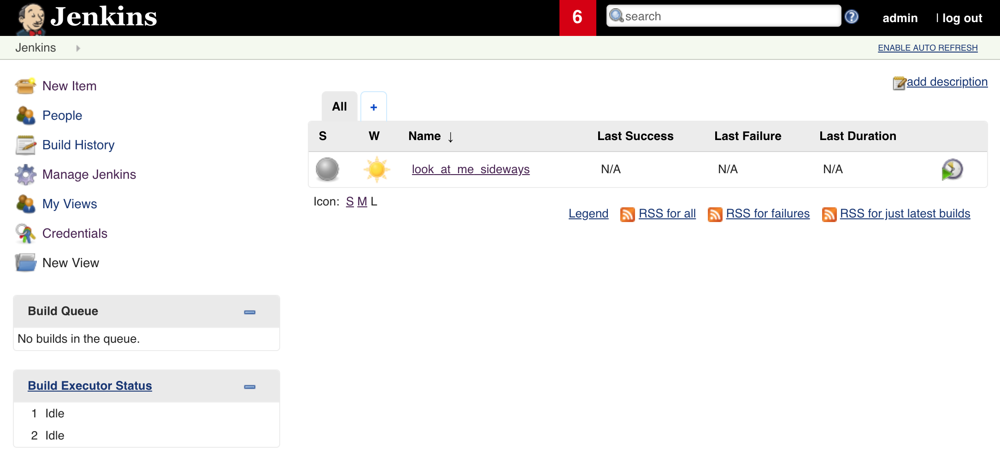
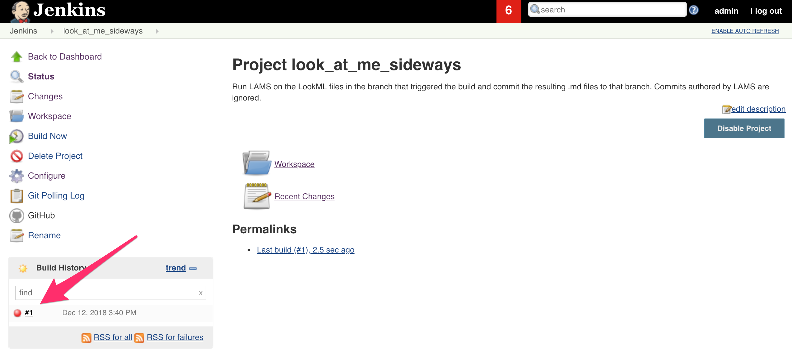
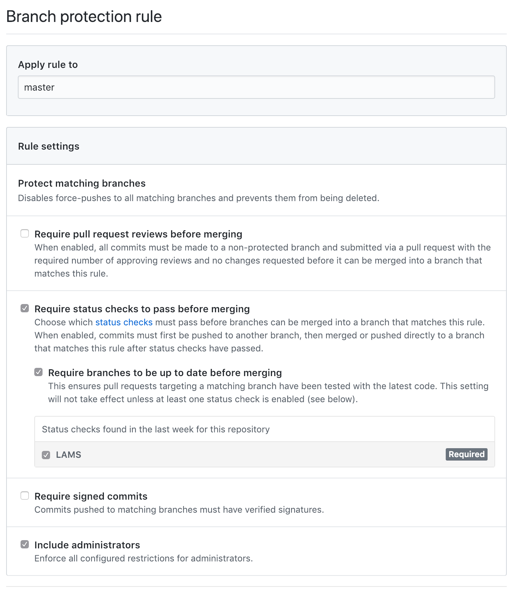

# LAMS Docker Image

**Note:** This configuration is out of date and may not work with LAMS v2. Please review [v2 release notes](https://looker-open-source.github.io/release-notes/v2) for details. In particular, look for error messages on the console's standard output rather than a file output to be committed back to the repo. 

This is a fully functional Jenkins Server with a pre-configured job that is triggered by a webhook from a specified LookML Git repo, lints the branch invoking the job, commits the lint results back into the branch and sets a status to the commits. 

<a name=docker_run></a>
# Usage

```
docker run \
    -p 8080:8080 \
    -p 443:443 \
    -v jenkins_home:/var/jenkins_home/ \
    -v /path/to/git/keys:/var/jenkins_home/.ssh/ \
    -e HOST_IP=<HOST_MACHINE_IP> \
    -e GIT_TOKEN=<GIT_PERSONAL_ACCESS_TOKEN> \
    -e ACCOUNT_NAME=<LOOKKML_REPO_OWNER> \
    -e REPO_NAME=<LOOKML_REPO_NAME> \ 
    -e reporting=<yes|no> \
    -e reporting_user=<EMAIL> \ 
    -e license_key=<LOOKER_LICENSE_KEY> \
    lams/lams
``` 

PS: Please make sure that port 8080 and 443 are also open on the host machine. 

# Installation Instructions

1. [Build](#build_container) and [run](#run_container) the container as per the instructions below.
2. Once the container is up and running, navigate to `https://[HOST_IP]:8080` where you will be prompted with a login screen. Login with admin/admin as your username/password. You should be able to see the `look_at_me_sideways` job as shown below.
   
   
   
3. Navigate to `/user/admin/configure` and change your password.
4. Configure Git to fire a webhook on push events as follows:
    - Navigate to `https://github.com/ACCOUNT_NAME/REPO_NAME/settings/hooks` 
    - Click **Add Webhook** at the top right
    - Fill in the **Payload URL** with your Jenkins endpoint `http://JENKINS_URL:8080/generic-webhook-trigger/invoke?token=lams`
    - Set **Content type** to `application/json`
    - Tick **Just the push event**
    - Ensure **Active** is ticked
5. Navigate to your Looker instance, and make a test commit to trigger the webhook and the jenkins look_at_me_sideways job for the first time. You can confirm that everything worked by navigating to `/job/look_at_me_sideways/` in Jenkins where you should see the below:
   
   

6. Set the _master_ branch to be protected from commits that fail the tests. Navigate to `https://github.com/ACCOUNT_NAME/REPO_NAME/settings/branches`, click **Add Rule** and set the settings as per the screenshot below:

    

If the **LAMS** status check does not show up under the Status Checks it means that Step 5 failed for some reason and you should check the job logs at `/job/look_at_me_sideways/1/console`.

<a name=build_container></a>
# Building the image

Make sure the Dockerfile is in your current working directory and run:

```
docker build -t lams/lams .
```

This will build the docker image which contains Jenkins, the latest LAMS, the required plugins, a pre-configured job as well as other essential settings required to hit the ground running. This step only needs to be done whenever there is an update.

<a name=run_container></a>
# Running the container
Running the container is done using the `docker run` command, together with a number of environment variables and volumes that need to be mounted. The full command is shown in the [Usage](#docker_run) section. The steps below outline how to obtain all the necessary information that is part of the run command:
1. **Specify various required environment variables**
   <br>These are passed using the `e` flag and are listed below:
    * `HOST_IP` - this is the IP address of the machine hosting the docker container
    * `GIT_TOKEN` - personal access token used in Git API calls from Jenkins. Can be generated by following these <a href="https://help.github.com/articles/creating-a-personal-access-token-for-the-command-line/">instructions</a>. The token must be granted the **repo scope**
    * `ACCOUNT_NAME`: The Git URL to the LookML project to be linted will be of the form `https://github.com/<ACCOUNT_NAME>/<REPO_NAME>`. The `ACCOUNT_NAME` is the account name under which the LookML project lives
    * `REPO_NAME`: The name of the repository hosting the LookML project. 
    * `reporting` - A `yes|no` optional field which will help us understand how LAMS is being used
    * `reporting_user` - Optional. Used to specify your email address. It may be used to associate your usage of LAMS with other activity or contact records that we have for you.
    * `license_key` - Optional. Your Looker license key. Also used for usage analysis purposes. Can be obtained from the _General Settings_ tab in the admin panel of your Looker instance

     PS: For more details on the Privacy Policy please refer to the _PRIVACY.md_ file in LAMS' project repo. <br>
2.  **Specify a named volume**
    <br>The Dockerfile defines a named volume called `jenkins_home` which is stored on the host machine and allows data (such as previous builds) in the jenkins home directory inside the container to survive stops/restarts/deletions. To do this simply pass `-v jenkins_home:/var/jenkins_home` to the `docker run` command. Please note that this volume will not store a copy of your ssh keys. 
3. **Mount your git ssh keys**
    <br>These _must_ have read/write access to the LookML Project repo. Instructions on generating ssh keys can be found <a href="https://help.github.com/articles/generating-a-new-ssh-key-and-adding-it-to-the-ssh-agent/">here</a>. Also make sure that the folder hosting the ssh keys on the host machine also contains a _known_hosts_ file which lists GitHub as a verified host. This can be done by testing your newly created ssh key (more information <a href="https://help.github.com/articles/testing-your-ssh-connection/">here</a>)

    To mount the keys using the `-v` flag followed by `<path_to_keys_on_host>:/var/jenkins_home/.ssh`.

    You also need to ensure that the keys are accessible by the jenkins user inside the container (user=jenkins, uid=1000).